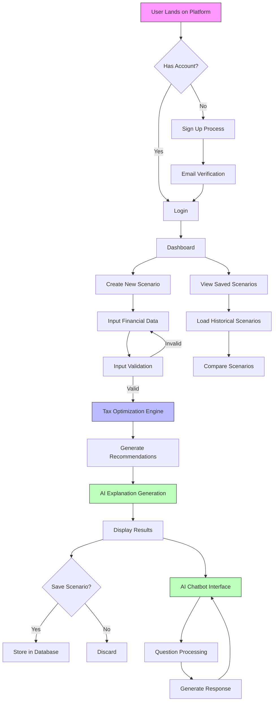
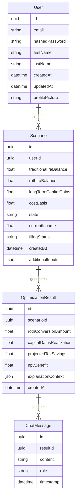
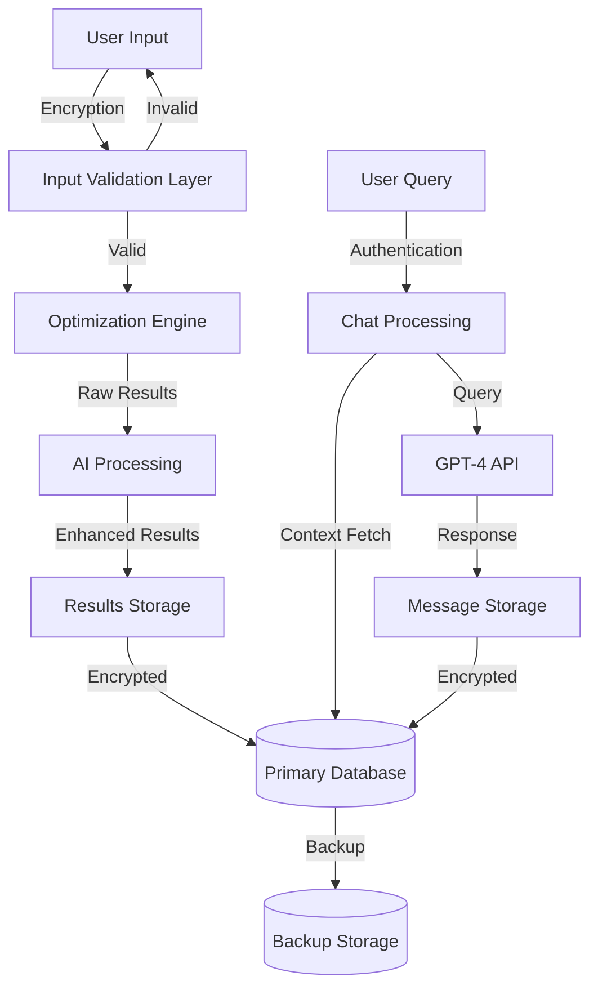
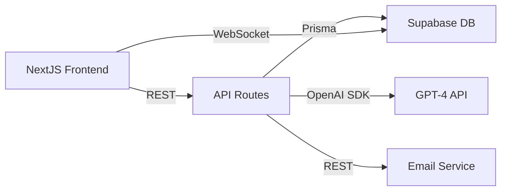

# Product Requirements Document (PRD)

# 1. INTRODUCTION

## 1.1 Purpose

This Software Requirements Specification (SRS) document provides a comprehensive description of the Low Income Year Tax Optimizer Tool. It details the functional and non-functional requirements for developers, project managers, QA engineers, and stakeholders involved in the development and deployment of the platform.

## 1.2 Scope

The Low Income Year Tax Optimizer Tool is a web-based platform that helps individuals optimize their financial decisions during low-income years. The system encompasses:

- Tax optimization calculations for traditional to Roth IRA conversions
- Long-term capital gains realization analysis
- State and federal tax bracket consideration
- Net Present Value (NPV) and long-term wealth maximization
- Personalized recommendations with AI-powered explanations

Key functionalities include:

- User account management and secure data handling
- Financial input collection and validation
- Tax optimization engine
- Scenario analysis and storage
- Interactive AI chatbot for recommendation explanations
- Historical scenario comparison and tracking

The platform specifically targets:

- Individuals taking career breaks
- Graduate students
- People experiencing temporary income reductions
- Financial planners advising clients in low-income situations

Out of scope:

- Tax filing services
- Real-time market data integration
- Professional tax advice certification
- Mobile applications
- Direct integration with financial institutions

# 2. PRODUCT DESCRIPTION

## 2.1 Product Perspective

The Low Income Year Tax Optimizer Tool operates as a standalone web application within the broader ecosystem of personal finance management tools. It interfaces with:

- User authentication systems through Supabase
- OpenAI's GPT-4 API for explanation generation
- Secure database systems for scenario storage
- Email systems for user communications

The system maintains independence from:

- Tax filing platforms
- Financial institution systems
- Investment management tools
- Market data providers

## 2.2 Product Functions

The core functions of the system include:

- User account creation and management
- Financial data collection and validation
- Tax optimization calculations:
  - Traditional to Roth IRA conversion analysis
  - Long-term capital gains optimization
  - Tax bracket impact assessment
  - NPV calculations
- AI-powered explanation generation, including visual charts
- Scenario storage and comparison
- Interactive recommendation exploration
- Historical analysis tracking

## 2.3 User Characteristics

Primary User Personas:

1. Career Break Individual

   - Age: 25-45
   - Technical expertise: Basic
   - Financial knowledge: Intermediate
   - Goals: Optimize temporary low-income period

2. Graduate Student

   - Age: 22-35
   - Technical expertise: Intermediate
   - Financial knowledge: Basic to Intermediate
   - Goals: Strategic financial planning during studies

3. Financial Planner

   - Age: 30-60
   - Technical expertise: Intermediate
   - Financial knowledge: Advanced
   - Goals: Client advisory support

4. Temporary Low-Income Individual

   - Age: 25-65
   - Technical expertise: Basic
   - Financial knowledge: Basic
   - Goals: Financial optimization during income reduction

## 2.4 Constraints

Technical Constraints:

- Web-only platform implementation
- Serverless architecture limitations
- API rate limits from OpenAI
- Database size restrictions from Supabase

Regulatory Constraints:

- Financial data privacy compliance
- Tax calculation disclaimer requirements
- User data protection regulations
- Non-advisory service limitations

Business Constraints:

- Initial deployment without mobile applications
- No direct financial institution integrations
- Limited to U.S. tax system

## 2.5 Assumptions and Dependencies

Assumptions:

- Users have basic understanding of tax concepts
- Internet access with modern web browser
- Users maintain accurate financial records
- Tax laws remain relatively stable

Dependencies:

- Supabase platform availability
- OpenAI API service reliability
- NextJS framework stability
- TailwindCSS framework maintenance
- Prisma ORM compatibility
- Vercel hosting service uptime
- Email service provider reliability

# 3. PROCESS FLOWCHART

# 4. FUNCTIONAL REQUIREMENTS

## 4.1 User Authentication and Management

### ID: F-001

### Description

User registration, authentication, and profile management system using Supabase authentication.

### Priority: High

| Requirement ID | Requirement Description | Acceptance Criteria |
| --- | --- | --- |
| F-001-1 | Email-based user registration | - Valid email format verification - Password strength requirements - Duplicate email prevention |
| F-001-2 | User authentication | - Secure login with email/password - Session management - Password reset functionality |
| F-001-3 | Profile management | - Update personal information - Profile picture upload - Email preferences management |

## 4.2 Financial Data Input System

### ID: F-002

### Description

Comprehensive form system for collecting user financial data required for optimization calculations.

### Priority: High

| Requirement ID | Requirement Description | Acceptance Criteria |
| --- | --- | --- |
| F-002-1 | Traditional IRA balance input | - Numerical validation - Maximum value limits - Required field validation |
| F-002-2 | Roth IRA balance input | - Numerical validation - Maximum value limits - Required field validation |
| F-002-3 | Capital gains input | - Long-term gains separation - Cost basis collection - Gain amount validation |
| F-002-4 | Tax bracket information | - State selection - Current income input - Filing status selection |

## 4.3 Optimization Engine

### ID: F-003

### Description

Core calculation engine for tax optimization and wealth maximization recommendations.

### Priority: Critical

| Requirement ID | Requirement Description | Acceptance Criteria |
| --- | --- | --- |
| F-003-1 | Roth conversion calculator | - Tax bracket analysis - Optimal conversion amount - NPV calculations |
| F-003-2 | Capital gains optimizer | - Tax bracket impact analysis - Optimal realization timing - Multi-year planning |
| F-003-3 | Combined strategy optimizer | - Holistic recommendation generation - Strategy prioritization - Risk assessment |

## 4.4 AI Explanation System

### ID: F-004

### Description

GPT-4 powered system for generating explanations and handling user queries about recommendations.

### Priority: High

| Requirement ID | Requirement Description | Acceptance Criteria |
| --- | --- | --- |
| F-004-1 | Recommendation explanation | - Clear language generation - Context-aware responses - Technical detail inclusion |
| F-004-2 | Interactive chatbot | - Natural language processing - Context retention - Follow-up question handling |
| F-004-3 | Strategy justification | - Tax law references - Mathematical explanation - Alternative scenario comparison |

## 4.5 Scenario Management

### ID: F-005

### Description

System for saving, comparing, and managing multiple scenario analyses.

### Priority: Medium

| Requirement ID | Requirement Description | Acceptance Criteria |
| --- | --- | --- |
| F-005-1 | Scenario storage | - Automatic saving - Manual saving options - Data versioning |
| F-005-2 | Scenario comparison | - Side-by-side analysis - Difference highlighting - Outcome comparison |
| F-005-3 | Historical tracking | - Timeline view - Progress monitoring - Scenario notes |

## 4.6 Data Export and Reporting

### ID: F-006

### Description

Functionality for exporting and reporting optimization results and analyses.

### Priority: Low

| Requirement ID | Requirement Description | Acceptance Criteria |
| --- | --- | --- |
| F-006-1 | PDF report generation | - Professional formatting - Complete data inclusion - Explanatory notes |
| F-006-2 | Data export | - CSV format support - Selected data fields - Export history tracking |
| F-006-3 | Summary reporting | - Key metrics display - Visual representations - Time-based comparisons |

# 5. NON-FUNCTIONAL REQUIREMENTS

## 5.1 Performance Requirements

| Requirement ID | Description | Target Metric |
| --- | --- | --- |
| P-001 | API Response Time | \< 500ms for 95% of requests |
| P-002 | Page Load Time | \< 2 seconds for initial load |
| P-003 | Optimization Calculation Time | \< 3 seconds for complex scenarios |
| P-004 | AI Response Generation | \< 5 seconds for explanation generation |
| P-005 | Concurrent Users | Support 1000 simultaneous users |
| P-006 | Database Query Time | \< 100ms for 90% of queries |

## 5.2 Safety Requirements

| Requirement ID | Description | Implementation |
| --- | --- | --- |
| S-001 | Data Backup | Daily automated backups with 30-day retention |
| S-002 | Error Recovery | Automatic rollback for failed transactions |
| S-003 | System State Monitoring | Real-time monitoring with alert thresholds |
| S-004 | Failover Protection | Redundant system components with automatic failover |
| S-005 | Data Validation | Input validation before processing calculations |

## 5.3 Security Requirements

| Requirement ID | Description | Implementation |
| --- | --- | --- |
| SEC-001 | Authentication | Multi-factor authentication through Supabase |
| SEC-002 | Data Encryption | AES-256 encryption for data at rest |
| SEC-003 | Session Management | 30-minute session timeout with refresh tokens |
| SEC-004 | API Security | Rate limiting and JWT authentication |
| SEC-005 | Data Privacy | PII encryption and secure data handling |
| SEC-006 | Access Control | Role-based access control (RBAC) |

## 5.4 Quality Requirements

### 5.4.1 Availability

- System uptime: 99.9%
- Planned maintenance: \< 4 hours per month
- Recovery time objective (RTO): \< 1 hour

### 5.4.2 Maintainability

- Code coverage: \> 80%
- Documentation: Comprehensive inline documentation
- Deployment frequency: Weekly releases
- Mean time to repair (MTTR): \< 2 hours

### 5.4.3 Usability

- First-time user success rate: \> 80%
- Task completion rate: \> 90%
- User error rate: \< 5%
- Help documentation: Context-sensitive help

### 5.4.4 Scalability

- Horizontal scaling: Auto-scaling based on load
- Database growth: Support 100% annual growth
- API capacity: 100,000 requests per day
- Storage capacity: 5GB per user

### 5.4.5 Reliability

- Mean time between failures (MTBF): \> 720 hours
- Error rate: \< 0.1% of transactions
- Data accuracy: 100% for calculations
- Backup success rate: 99.99%

## 5.5 Compliance Requirements

| Requirement ID | Description | Standard/Regulation |
| --- | --- | --- |
| C-001 | Data Protection | GDPR, CCPA compliance |
| C-002 | Financial Calculations | IRS calculation standards |
| C-003 | Accessibility | WCAG 2.1 Level AA |
| C-004 | Security Standards | SOC 2 Type II compliance |
| C-005 | Data Retention | 7-year data retention policy |
| C-006 | Disclaimer Requirements | Financial advice disclaimers |

# 6. DATA REQUIREMENTS

## 6.1 Data Models

## 6.2 Data Storage

### 6.2.1 Primary Storage

- Supabase PostgreSQL database for all persistent data
- Data partitioning by user_id for efficient querying
- Indexes on frequently queried fields:
  - scenario.created_at
  - optimization_result.scenario_id
  - chat_message.result_id

### 6.2.2 Data Retention

- User data: Retained indefinitely while account active
- Scenarios: 7-year retention period
- Optimization results: 7-year retention period
- Chat messages: 1-year retention period
- Inactive accounts: Archived after 2 years of inactivity

### 6.2.3 Backup Strategy

- Daily full database backups
- Hourly incremental backups
- 30-day backup retention
- Geographic replication across multiple regions
- Point-in-time recovery capability up to 7 days

## 6.3 Data Processing

### 6.3.1 Data Security

- AES-256 encryption for sensitive financial data
- Data anonymization for AI processing
- End-to-end encryption for user communications
- Encrypted data backups
- Access logging and audit trails

### 6.3.2 Data Validation

- Input sanitization for all user data
- Type checking and range validation
- Business rule validation
- Schema validation using Prisma
- Form validation using Yup

### 6.3.3 Data Transformation

- JSON serialization for complex objects
- Decimal precision handling for financial calculations
- Date/time normalization to UTC
- State/province code standardization
- Currency normalization to USD

# 7. EXTERNAL INTERFACES

## 7.1 User Interfaces

### 7.1.1 General Requirements

- Responsive web design supporting 1024px to 4K resolutions
- Dark/light theme support using TailwindCSS
- WCAG 2.1 Level AA compliance
- Consistent Shadcn component styling
- Loading states for all async operations

### 7.1.2 Key Interface Components

| Screen | Components | Requirements |
| --- | --- | --- |
| Landing Page | - Hero section - Feature overview - Sign-up form | - Clean, modern design - Mobile-responsive layout - Clear CTA buttons |
| Scenario Analysis | - Multi-step form - Results dashboard - AI chat interface | - Progress indicator - Real-time validation - Collapsible sections |
| Saved Scenarios | - Scenario cards - Comparison view - Filter controls | - Sort/filter options - Pagination - Quick actions |
| Profile Management | - Profile form - Settings panel - Avatar upload | - Inline editing - Validation feedback - Success notifications |

## 7.2 Software Interfaces

### 7.2.1 External Service Integration

| Service | Interface Type | Purpose |
| --- | --- | --- |
| Supabase | REST API | - User authentication - Database operations - Real-time subscriptions |
| OpenAI | REST API | - GPT-4 for explanations - Whisper for voice input - Vision for document processing |
| Resend | REST API | - Transactional emails - Notification delivery |
| Vercel | Edge Functions | - Serverless computation - API routing |

### 7.2.2 Internal Service Communication

## 7.3 Communication Interfaces

### 7.3.1 Network Protocols

- HTTPS for all client-server communication
- WebSocket for real-time updates
- HTTP/2 for API performance
- SSL/TLS 1.3 encryption

### 7.3.2 Data Exchange Formats

| Format | Usage |
| --- | --- |
| JSON | - API requests/responses - Configuration data - State management |
| Protocol Buffers | - High-performance data serialization |
| JWT | - Authentication tokens - API authorization |

### 7.3.3 API Endpoints

| Endpoint | Method | Purpose |
| --- | --- | --- |
| /api/scenarios | POST | Create new scenario |
| /api/scenarios | GET | Retrieve saved scenarios |
| /api/optimize | POST | Run optimization calculations |
| /api/chat | POST | Process AI chat messages |
| /api/export | GET | Generate scenario reports |

# 8. APPENDICES

## 8.1 GLOSSARY

| Term | Definition |
| --- | --- |
| Traditional IRA | Individual Retirement Account funded with pre-tax dollars, with withdrawals taxed as ordinary income |
| Roth IRA | Individual Retirement Account funded with post-tax dollars, with qualified withdrawals tax-free |
| Long-term Capital Gains | Profits from selling assets held longer than one year, typically taxed at preferential rates |
| Cost Basis | Original purchase price of an asset used to calculate capital gains |
| Net Present Value (NPV) | Current value of future cash flows, accounting for time value of money |
| Tax Bracket | Income range subject to a specific tax rate |
| Roth Conversion | Process of moving funds from a Traditional IRA to a Roth IRA, subject to income tax |
| Marginal Tax Rate | Tax rate applied to the next dollar of taxable income |

## 8.2 ACRONYMS

| Acronym | Expansion |
| --- | --- |
| API | Application Programming Interface |
| AWS | Amazon Web Services |
| CCPA | California Consumer Privacy Act |
| CTA | Call To Action |
| GDPR | General Data Protection Regulation |
| GCP | Google Cloud Platform |
| IRA | Individual Retirement Account |
| IRS | Internal Revenue Service |
| JWT | JSON Web Token |
| MTBF | Mean Time Between Failures |
| MTTR | Mean Time To Repair |
| NPV | Net Present Value |
| ORM | Object-Relational Mapping |
| PII | Personally Identifiable Information |
| RBAC | Role-Based Access Control |
| REST | Representational State Transfer |
| RTO | Recovery Time Objective |
| SOC | Service Organization Control |
| SQL | Structured Query Language |
| SSL | Secure Sockets Layer |
| TLS | Transport Layer Security |
| UTC | Coordinated Universal Time |
| WCAG | Web Content Accessibility Guidelines |

## 8.3 ADDITIONAL REFERENCES

| Reference | Description | URL |
| --- | --- | --- |
| IRS Tax Brackets | Official tax bracket information | https://www.irs.gov/tax-rates |
| NextJS Documentation | Framework documentation | https://nextjs.org/docs |
| Supabase Documentation | Database and authentication | https://supabase.com/docs |
| OpenAI API Documentation | AI integration reference | https://platform.openai.com/docs |
| Prisma Documentation | ORM reference | https://www.prisma.io/docs |
| TailwindCSS Documentation | Styling framework | https://tailwindcss.com/docs |
| Shadcn Documentation | UI component library | https://ui.shadcn.com |
| Vercel Documentation | Deployment platform | https://vercel.com/docs |