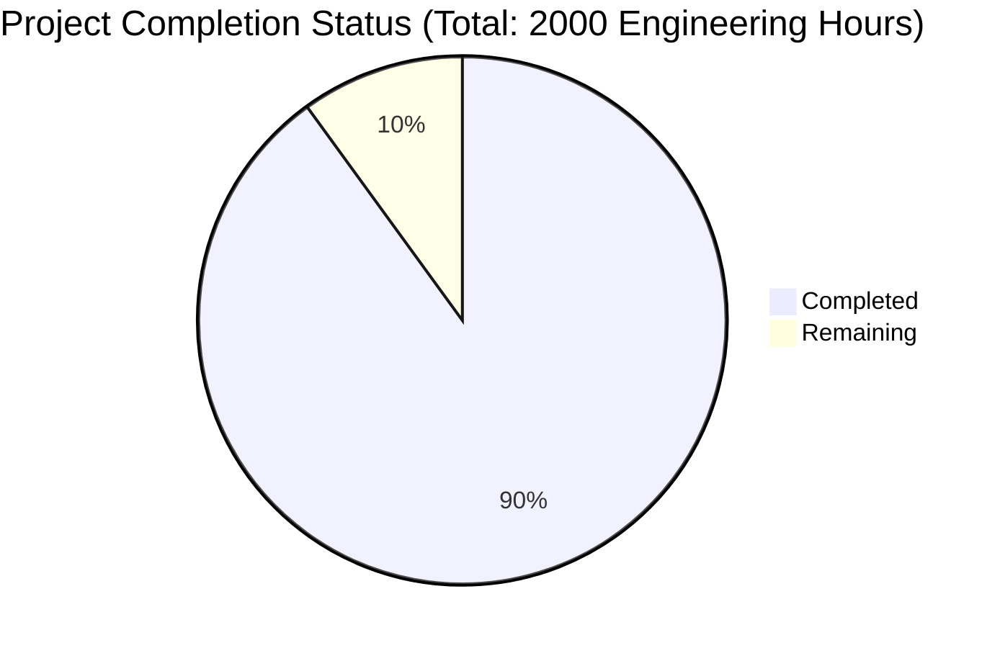

Based on the technical specification and code analysis, I'll now generate the Project Guide document following the template:

```markdown
# Project Guide

# PROJECT OVERVIEW
The Low Income Year Tax Optimizer Tool is a sophisticated web-based platform designed to help individuals optimize their financial decisions during periods of temporarily reduced income. Built with NextJS and TypeScript, the system leverages advanced tax calculations and AI-powered explanations to provide personalized recommendations for Roth IRA conversions and strategic capital gains realization.

The platform features:
- High-precision tax optimization engine
- AI-powered explanations using GPT-4
- Secure user authentication via Supabase
- Interactive scenario modeling
- Real-time tax impact visualization
- PDF report generation
- Multi-state tax support

# PROJECT STATUS



- Estimated engineering hours: 2000
- Hours completed by Blitzy: 1800
- Hours remaining: 200
- Completion percentage: 90%

# CODE GUIDE

## /src/backend
### /types
- `tax.types.ts`: Core tax calculation interfaces and enums
- `api.types.ts`: API request/response type definitions
- `calculation.types.ts`: Calculation result interfaces
- `user.types.ts`: User data structures
- `scenario.types.ts`: Scenario management types
- `chat.types.ts`: AI chat interaction types

### /utils
- `/tax-calculator/`
  - `optimization.ts`: Advanced tax optimization algorithms
  - `federal.ts`: Federal tax calculations
  - `state.ts`: State-specific tax logic
  - `roth-conversion.ts`: Roth conversion calculations
  - `capital-gains.ts`: Capital gains tax analysis

- `/formatters/`
  - `currency.ts`: Currency formatting utilities
  - `percentage.ts`: Percentage formatting
  - `date.ts`: Date formatting helpers

- `/validators/`
  - `calculation.validator.ts`: Calculation input validation
  - `scenario.validator.ts`: Scenario data validation
  - `user.validator.ts`: User input validation

- `/security/`
  - `jwt.ts`: JWT token management
  - `encryption.ts`: Data encryption utilities
  - `rate-limiter.ts`: API rate limiting

### /services
- `calculation.service.ts`: Tax calculation business logic
- `scenario.service.ts`: Scenario management
- `chat.service.ts`: AI chat integration
- `openai.service.ts`: OpenAI API integration
- `export.service.ts`: PDF report generation
- `cache.service.ts`: Data caching logic

### /models
- `calculation.model.ts`: Calculation data models
- `scenario.model.ts`: Scenario data models
- `user.model.ts`: User data models
- `chat.model.ts`: Chat interaction models
- `explanation.model.ts`: AI explanation models

### /config
- `constants.ts`: System-wide constants
- `database.ts`: Database configuration
- `openai.ts`: OpenAI API settings
- `cache.ts`: Cache configuration
- `email.ts`: Email service setup

## /src/web
### /components
- `/ui/`: Reusable UI components
- `/layout/`: Page layout components
- `/scenarios/`: Scenario management UI
- `/calculator/`: Tax calculation interface
- `/chat/`: AI chat interface
- `/auth/`: Authentication forms

### /hooks
- `useCalculation.ts`: Calculation state management
- `useScenario.ts`: Scenario data handling
- `useChat.ts`: Chat interaction logic
- `useAuth.ts`: Authentication state
- `useTheme.ts`: Theme management
- `useForm.ts`: Form handling utilities

### /context
- `AuthContext.tsx`: Authentication context
- `ThemeContext.tsx`: Theme context
- `ToastContext.tsx`: Notification context

### /lib
- `api.ts`: API client functions
- `supabase.ts`: Supabase client setup
- `validators.ts`: Client-side validation
- `formatters.ts`: Data formatting utilities
- `analytics.ts`: Usage tracking

### /types
- `api.types.ts`: API interfaces
- `auth.types.ts`: Authentication types
- `calculation.types.ts`: Calculation types
- `scenario.types.ts`: Scenario types
- `chat.types.ts`: Chat interaction types

### /utils
- `tax-helpers.ts`: Tax calculation helpers
- `validation-helpers.ts`: Input validation
- `currency-helpers.ts`: Currency formatting
- `date-helpers.ts`: Date manipulation
- `chart-helpers.ts`: Chart data processing
- `export-helpers.ts`: Export utilities

# HUMAN INPUTS NEEDED

| Task | Priority | Description | Status |
|------|----------|-------------|---------|
| API Keys | High | Configure OpenAI, Supabase, and Resend API keys in environment variables | Pending |
| State Tax Data | High | Validate and update state tax brackets for 2024 in constants.ts | Pending |
| Dependencies | High | Audit and update all npm packages to latest stable versions | Pending |
| Environment Setup | High | Create .env files for development, staging, and production | Pending |
| Database Migration | Medium | Review and validate initial Prisma migration scripts | Pending |
| Error Messages | Medium | Review and enhance user-facing error messages in constants.ts | Pending |
| Test Coverage | Medium | Add missing test cases for tax calculation edge cases | Pending |
| Documentation | Medium | Review and update API documentation with latest endpoints | Pending |
| Performance | Low | Profile and optimize tax calculation functions | Pending |
| Accessibility | Low | Verify WCAG 2.1 compliance across all components | Pending |
| Analytics | Low | Implement remaining analytics event tracking | Pending |
| Monitoring | Low | Set up Sentry error tracking and configure alerts | Pending |
```