# Technical Specifications

# 1. INTRODUCTION

## 1.1 EXECUTIVE SUMMARY

The Low Income Year Tax Optimizer Tool is a web-based platform designed to help individuals optimize their financial decisions during periods of temporarily reduced income. The system provides data-driven recommendations for tax-advantaged actions such as Roth IRA conversions and strategic capital gains realization. By analyzing multiple variables including retirement account balances, potential capital gains, and tax brackets, the platform delivers personalized optimization strategies that maximize long-term wealth accumulation.

The platform addresses the critical need for sophisticated tax planning during unique low-income opportunities, particularly benefiting graduate students, career-break professionals, and individuals experiencing temporary income reductions. Through AI-powered explanations and interactive exploration of recommendations, users can make informed decisions about complex tax optimization strategies.

## 1.2 SYSTEM OVERVIEW

### Project Context

| Aspect | Description |
|--------|-------------|
| Market Position | First-to-market comprehensive tax optimization platform for low-income year planning |
| Target Audience | Individual investors, graduate students, career-break professionals |
| Competitive Advantage | AI-powered explanations, comprehensive optimization across multiple tax strategies |
| Enterprise Integration | Standalone web platform with potential for future financial advisor tooling integration |

### High-Level Description

The system employs a modern web architecture built on NextJS with React, leveraging serverless computing through Vercel for scalability and performance. Core components include:

- Tax optimization engine for multi-variable analysis
- AI-powered explanation system using GPT-4
- Secure user data management through Supabase
- Interactive scenario modeling and comparison tools
- Historical analysis tracking and reporting

### Success Criteria

| Metric | Target |
|--------|---------|
| User Adoption | 10,000 active users within first year |
| Recommendation Accuracy | 99.9% calculation accuracy |
| User Satisfaction | 90% positive feedback on recommendations |
| Platform Performance | 99.9% uptime, <500ms average response time |
| Engagement | Average 3 scenarios per user annually |

## 1.3 SCOPE

### In-Scope Elements

#### Core Features and Functionalities

- User authentication and profile management
- Financial data collection and validation
- Tax optimization calculations
- AI-powered recommendation explanations
- Scenario storage and comparison
- Interactive chatbot interface
- PDF report generation

#### Implementation Boundaries

| Boundary Type | Coverage |
|--------------|-----------|
| Geographic | United States tax system only |
| User Types | Individual investors and financial planners |
| Data Domains | Retirement accounts, capital gains, income tax brackets |
| Technical Scope | Web platform with responsive design |

### Out-of-Scope Elements

- Tax filing services or direct IRS integration
- Mobile applications
- International tax systems
- Real-time market data integration
- Direct financial institution connections
- Professional tax advice certification
- Automated trade execution
- Estate planning optimization
- Alternative investment analysis
- Tax loss harvesting calculations

# 2. SYSTEM ARCHITECTURE

## 2.1 High-Level Architecture

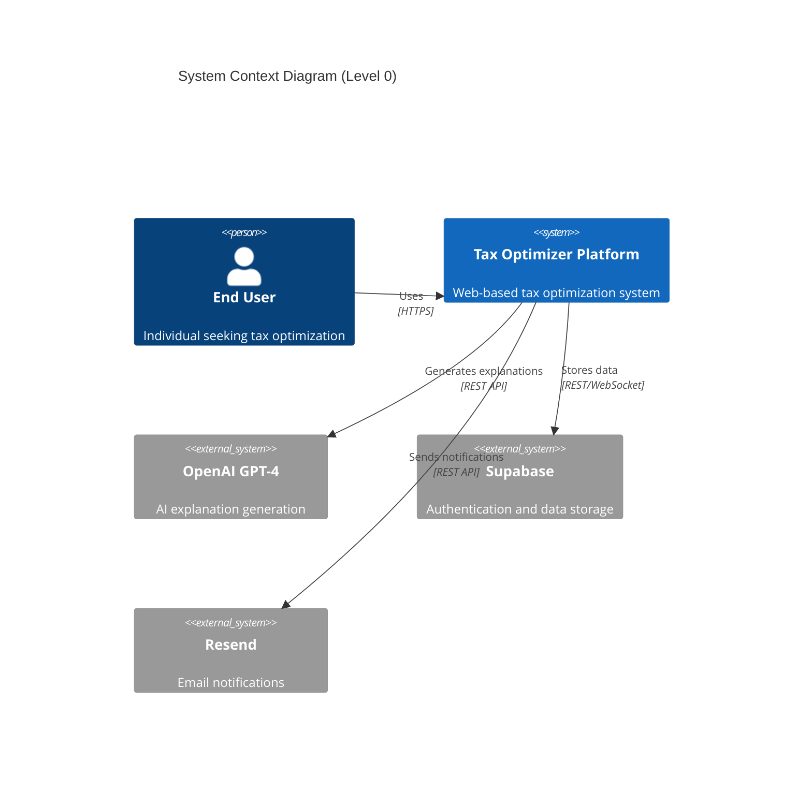
```mermaid
C4Context
    title System Context Diagram (Level 0)
    
    Person(user, "End User", "Individual seeking tax optimization")
    System(taxOptimizer, "Tax Optimizer Platform", "Web-based tax optimization system")
    System_Ext(openai, "OpenAI GPT-4", "AI explanation generation")
    System_Ext(supabase, "Supabase", "Authentication and data storage")
    System_Ext(email, "Resend", "Email notifications")
    
    Rel(user, taxOptimizer, "Uses", "HTTPS")
    Rel(taxOptimizer, openai, "Generates explanations", "REST API")
    Rel(taxOptimizer, supabase, "Stores data", "REST/WebSocket")
    Rel(taxOptimizer, email, "Sends notifications", "REST API")
```

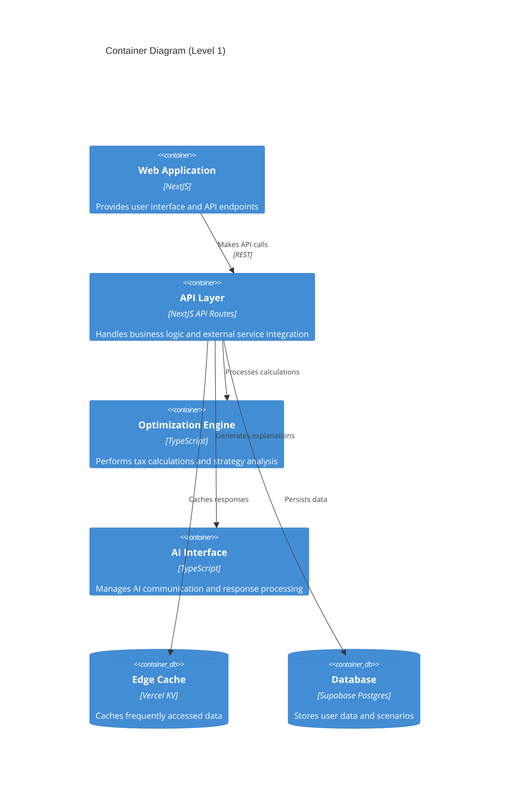
```mermaid
C4Container
    title Container Diagram (Level 1)
    
    Container(web, "Web Application", "NextJS", "Provides user interface and API endpoints")
    Container(api, "API Layer", "NextJS API Routes", "Handles business logic and external service integration")
    Container(optimizer, "Optimization Engine", "TypeScript", "Performs tax calculations and strategy analysis")
    Container(ai, "AI Interface", "TypeScript", "Manages AI communication and response processing")
    ContainerDb(cache, "Edge Cache", "Vercel KV", "Caches frequently accessed data")
    ContainerDb(db, "Database", "Supabase Postgres", "Stores user data and scenarios")
    
    Rel(web, api, "Makes API calls", "REST")
    Rel(api, optimizer, "Processes calculations")
    Rel(api, ai, "Generates explanations")
    Rel(api, cache, "Caches responses")
    Rel(api, db, "Persists data")
```

## 2.2 Component Details

### 2.2.1 Core Components

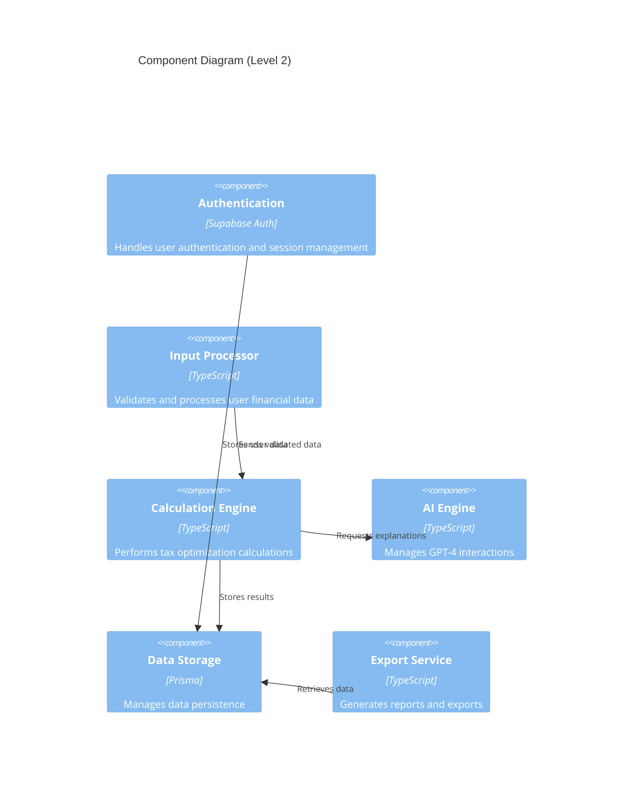
```mermaid
C4Component
    title Component Diagram (Level 2)
    
    Component(auth, "Authentication", "Supabase Auth", "Handles user authentication and session management")
    Component(input, "Input Processor", "TypeScript", "Validates and processes user financial data")
    Component(calc, "Calculation Engine", "TypeScript", "Performs tax optimization calculations")
    Component(ai, "AI Engine", "TypeScript", "Manages GPT-4 interactions")
    Component(storage, "Data Storage", "Prisma", "Manages data persistence")
    Component(export, "Export Service", "TypeScript", "Generates reports and exports")
    
    Rel(auth, storage, "Stores user data")
    Rel(input, calc, "Sends validated data")
    Rel(calc, ai, "Requests explanations")
    Rel(calc, storage, "Stores results")
    Rel(export, storage, "Retrieves data")
```

### 2.2.2 Data Flow

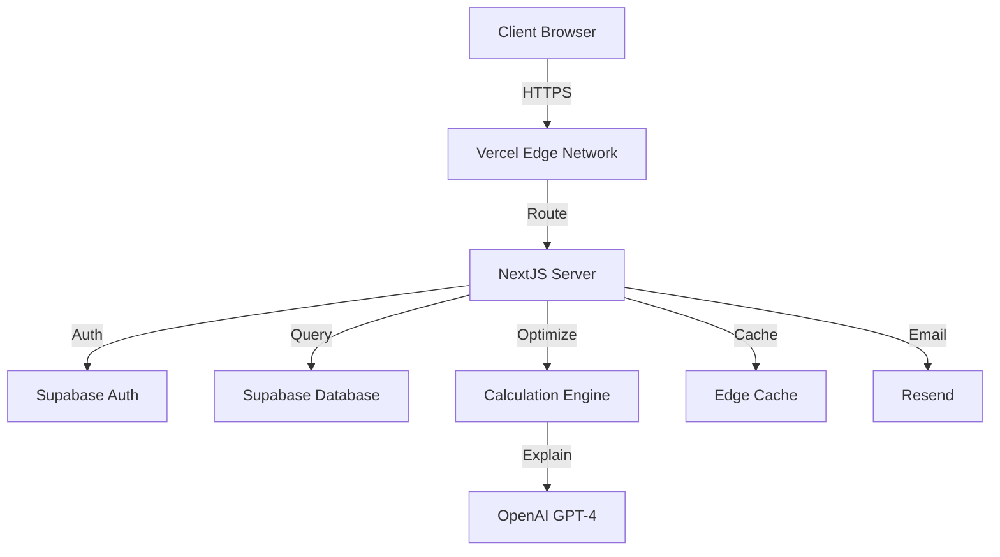
```mermaid
flowchart TD
    A[Client Browser] -->|HTTPS| B[Vercel Edge Network]
    B -->|Route| C[NextJS Server]
    C -->|Auth| D[Supabase Auth]
    C -->|Query| E[Supabase Database]
    C -->|Optimize| F[Calculation Engine]
    F -->|Explain| G[OpenAI GPT-4]
    C -->|Cache| H[Edge Cache]
    C -->|Email| I[Resend]
```

## 2.3 Technical Decisions

| Component | Decision | Justification |
|-----------|----------|---------------|
| Architecture Style | Monolithic | Simplifies deployment, reduces complexity for initial scale |
| API Pattern | REST | Industry standard, excellent tooling support |
| Data Storage | Postgres | ACID compliance, robust querying, Supabase integration |
| State Management | Server Components | Reduces client-side complexity, improves SEO |
| Caching Strategy | Edge Caching | Improves performance, reduces database load |

## 2.4 Cross-Cutting Concerns

### 2.4.1 System Monitoring

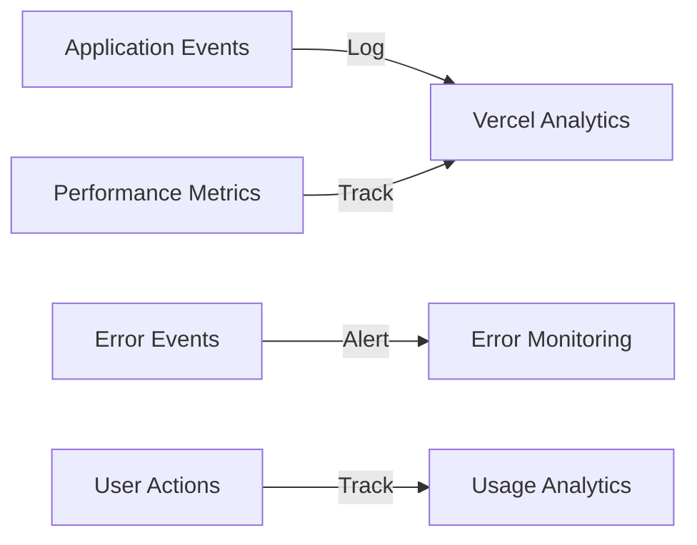
```mermaid
flowchart LR
    A[Application Events] -->|Log| B[Vercel Analytics]
    C[Performance Metrics] -->|Track| B
    D[Error Events] -->|Alert| E[Error Monitoring]
    F[User Actions] -->|Track| G[Usage Analytics]
```

### 2.4.2 Deployment Architecture

```mermaid
C4Deployment
    title Deployment Diagram
    
    Deployment_Node(cdn, "CDN", "Vercel Edge Network"){
        Container(static, "Static Assets", "NextJS static files")
    }
    
    Deployment_Node(compute, "Compute", "Vercel Serverless"){
        Container(app, "Application", "NextJS")
        Container(api, "API Functions", "Edge Functions")
    }
    
    Deployment_Node(db, "Database", "Supabase"){
        ContainerDb(postgres, "PostgreSQL", "User data and scenarios")
        Container(auth, "Auth Service", "Authentication")
    }
    
    Rel(cdn, compute, "Routes requests")
    Rel(compute, db, "Persists data")
```

## 2.5 Security Architecture

| Layer | Security Measure | Implementation |
|-------|-----------------|----------------|
| Network | Edge Protection | Vercel DDoS protection |
| Application | Authentication | Supabase JWT tokens |
| Data | Encryption | AES-256 at rest |
| API | Rate Limiting | 100 requests/minute |
| Session | Management | 30-minute timeout |

## 2.6 Scaling Considerations

| Component | Scaling Strategy | Capacity Target |
|-----------|-----------------|-----------------|
| Web Application | Horizontal | 1000 concurrent users |
| Database | Vertical | 1TB data storage |
| API Functions | Auto-scaling | 100K requests/day |
| Cache | Distributed | 10GB cache size |
| File Storage | CDN Distribution | 100GB storage |

# 3. SYSTEM COMPONENTS ARCHITECTURE

## 3.1 USER INTERFACE DESIGN

### 3.1.1 Design Specifications

| Aspect | Requirement | Implementation |
|--------|-------------|----------------|
| Visual Hierarchy | Consistent typography scale | Font sizes: 12px-48px with 1.5 scale |
| Component Library | Shadcn components | Customized dark/light themes |
| Responsive Design | Mobile-first approach | Breakpoints: 640px, 768px, 1024px, 1280px |
| Accessibility | WCAG 2.1 Level AA | ARIA labels, keyboard navigation, contrast ratios |
| Browser Support | Modern browsers | Chrome 90+, Firefox 90+, Safari 14+, Edge 90+ |
| Theme Support | Dark/light modes | System preference detection, manual toggle |
| Internationalization | English only (Phase 1) | UTF-8 encoding, date/currency formatting |

### 3.1.2 Interface Elements

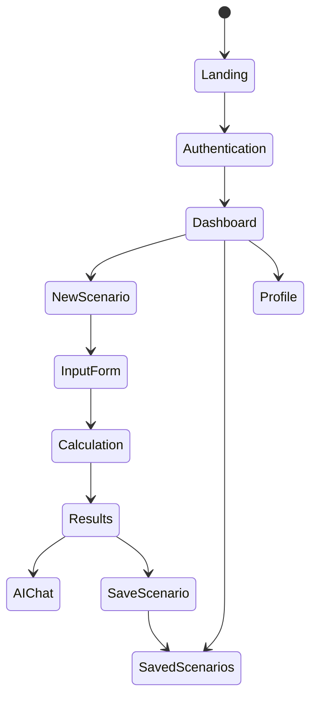
```mermaid
stateDiagram-v2
    [*] --> Landing
    Landing --> Authentication
    Authentication --> Dashboard
    Dashboard --> NewScenario
    Dashboard --> SavedScenarios
    Dashboard --> Profile
    NewScenario --> InputForm
    InputForm --> Calculation
    Calculation --> Results
    Results --> AIChat
    Results --> SaveScenario
    SaveScenario --> SavedScenarios
```

### 3.1.3 Critical User Flows

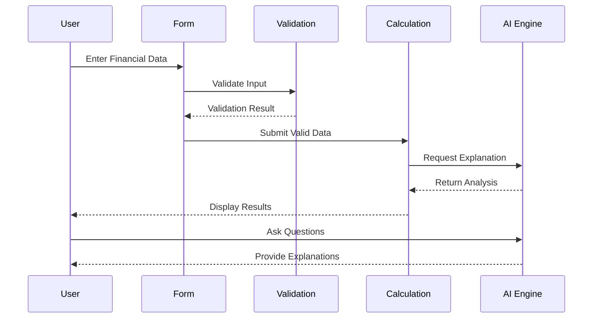
```mermaid
sequenceDiagram
    participant U as User
    participant F as Form
    participant V as Validation
    participant C as Calculation
    participant AI as AI Engine
    
    U->>F: Enter Financial Data
    F->>V: Validate Input
    V-->>F: Validation Result
    F->>C: Submit Valid Data
    C->>AI: Request Explanation
    AI-->>C: Return Analysis
    C-->>U: Display Results
    U->>AI: Ask Questions
    AI-->>U: Provide Explanations
```

## 3.2 DATABASE DESIGN

### 3.2.1 Schema Design

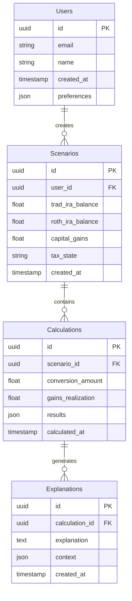
```mermaid
erDiagram
    Users ||--o{ Scenarios : creates
    Users {
        uuid id PK
        string email
        string name
        timestamp created_at
        json preferences
    }
    Scenarios ||--o{ Calculations : contains
    Scenarios {
        uuid id PK
        uuid user_id FK
        float trad_ira_balance
        float roth_ira_balance
        float capital_gains
        string tax_state
        timestamp created_at
    }
    Calculations ||--o{ Explanations : generates
    Calculations {
        uuid id PK
        uuid scenario_id FK
        float conversion_amount
        float gains_realization
        json results
        timestamp calculated_at
    }
    Explanations {
        uuid id PK
        uuid calculation_id FK
        text explanation
        json context
        timestamp created_at
    }
```

### 3.2.2 Data Management Strategy

| Component | Strategy | Details |
|-----------|----------|----------|
| Migrations | Progressive | Version-controlled, reversible migrations |
| Versioning | Semantic | Major.Minor.Patch format |
| Retention | Time-based | 7-year retention for financial data |
| Archival | Automated | Monthly archival of inactive scenarios |
| Privacy | Encryption | Column-level encryption for PII |
| Auditing | Comprehensive | All data modifications logged |

### 3.2.3 Performance Optimization

| Feature | Implementation | Purpose |
|---------|----------------|----------|
| Indexes | Composite | user_id + created_at for scenarios |
| Partitioning | Date-based | Monthly partitions for calculations |
| Caching | Redis | 1-hour TTL for frequent queries |
| Replication | Read replicas | 3 replicas across regions |
| Backups | Daily | Full backup with 30-day retention |
| Security | Row-level | User-based access control |

## 3.3 API DESIGN

### 3.3.1 API Architecture

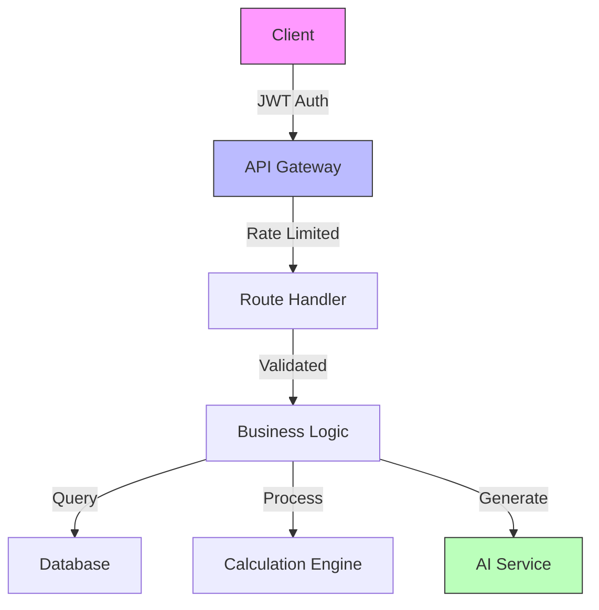
```mermaid
flowchart TD
    A[Client] -->|JWT Auth| B[API Gateway]
    B -->|Rate Limited| C[Route Handler]
    C -->|Validated| D[Business Logic]
    D -->|Query| E[Database]
    D -->|Process| F[Calculation Engine]
    D -->|Generate| G[AI Service]
    
    style A fill:#f9f,stroke:#333
    style B fill:#bbf,stroke:#333
    style G fill:#bfb,stroke:#333
```

### 3.3.2 Endpoint Specifications

| Endpoint | Method | Purpose | Rate Limit |
|----------|--------|---------|------------|
| /api/v1/scenarios | POST | Create scenario | 100/hour |
| /api/v1/scenarios/:id | GET | Retrieve scenario | 1000/hour |
| /api/v1/calculate | POST | Run optimization | 50/hour |
| /api/v1/explain | POST | Generate explanation | 100/hour |
| /api/v1/chat | POST | Process chat message | 200/hour |

### 3.3.3 Integration Requirements

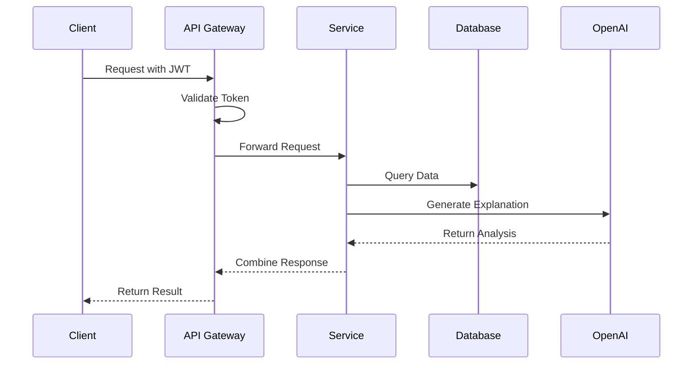
```mermaid
sequenceDiagram
    participant C as Client
    participant A as API Gateway
    participant S as Service
    participant D as Database
    participant AI as OpenAI
    
    C->>A: Request with JWT
    A->>A: Validate Token
    A->>S: Forward Request
    S->>D: Query Data
    S->>AI: Generate Explanation
    AI-->>S: Return Analysis
    S-->>A: Combine Response
    A-->>C: Return Result
```

| Integration | Type | Requirements |
|-------------|------|--------------|
| OpenAI | REST | Retry logic, timeout: 10s |
| Supabase | SDK | Connection pooling, timeout: 5s |
| Email | REST | Queue-based, retry: 3x |
| Analytics | Event | Batch processing, buffer: 100 |
| Monitoring | Stream | Real-time, sampling: 10% |

# 4. TECHNOLOGY STACK

## 4.1 PROGRAMMING LANGUAGES

| Language | Version | Usage | Justification |
|----------|---------|--------|---------------|
| TypeScript | 5.2+ | Frontend, API | Type safety, IDE support, maintainability |
| JavaScript | ES2022 | Runtime | NextJS compatibility, browser support |
| SQL | PostgreSQL 15+ | Database | Supabase compatibility, ACID compliance |

## 4.2 FRAMEWORKS & LIBRARIES

### Core Frameworks

| Framework | Version | Purpose | Justification |
|-----------|---------|---------|---------------|
| NextJS | 14.0+ | Full-stack framework | Server components, API routes, SEO optimization |
| React | 18.0+ | UI library | Component reusability, state management |
| TailwindCSS | 3.3+ | Styling | Utility-first approach, maintainable styling |
| Prisma | 5.0+ | ORM | Type-safe database queries, migration management |

### Supporting Libraries

| Library | Version | Purpose |
|---------|---------|---------|
| react-hook-form | 7.0+ | Form management |
| yup | 1.3+ | Schema validation |
| shadcn/ui | 0.5+ | UI components |
| lucide-react | 0.3+ | Icons |
| date-fns | 2.30+ | Date manipulation |
| zod | 3.22+ | Runtime type checking |

## 4.3 DATABASES & STORAGE

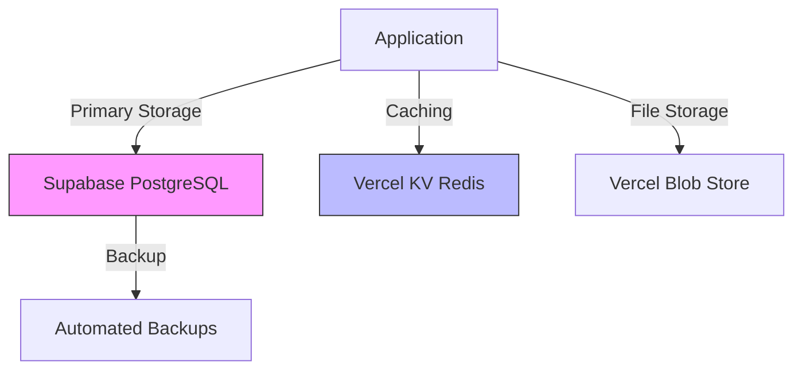
```mermaid
flowchart TD
    A[Application] -->|Primary Storage| B[Supabase PostgreSQL]
    A -->|Caching| C[Vercel KV Redis]
    A -->|File Storage| D[Vercel Blob Store]
    B -->|Backup| E[Automated Backups]
    
    style B fill:#f9f,stroke:#333
    style C fill:#bbf,stroke:#333
```

### Storage Solutions

| Component | Technology | Purpose |
|-----------|------------|---------|
| Primary Database | Supabase PostgreSQL | User data, scenarios, calculations |
| Cache Layer | Vercel KV (Redis) | Session data, API responses |
| File Storage | Vercel Blob Store | User uploads, exports |
| Edge Cache | Vercel Edge Cache | Static assets, API responses |

## 4.4 THIRD-PARTY SERVICES

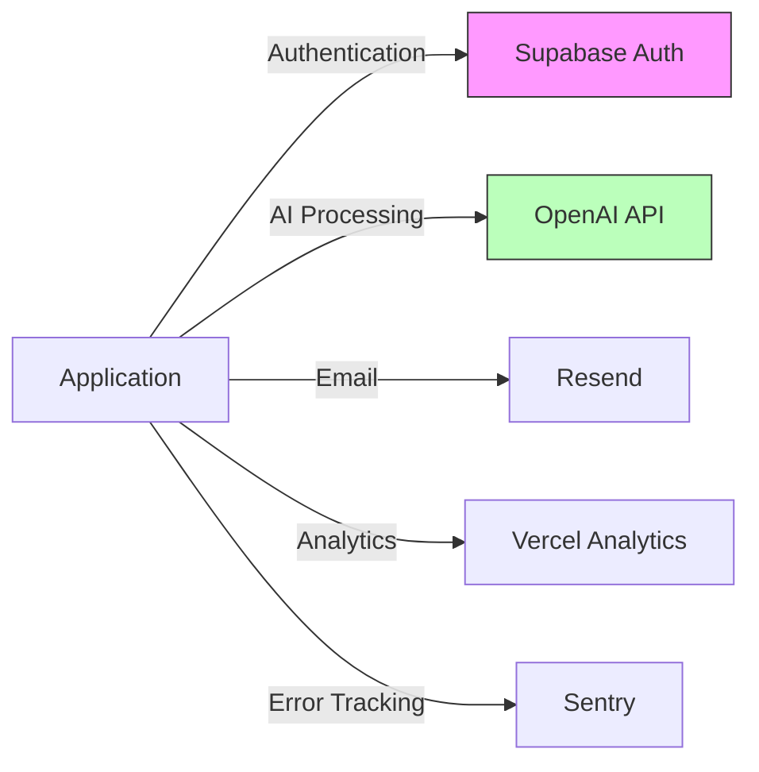
```mermaid
flowchart LR
    A[Application] -->|Authentication| B[Supabase Auth]
    A -->|AI Processing| C[OpenAI API]
    A -->|Email| D[Resend]
    A -->|Analytics| E[Vercel Analytics]
    A -->|Error Tracking| F[Sentry]
    
    style B fill:#f9f,stroke:#333
    style C fill:#bfb,stroke:#333
```

| Service | Purpose | Integration Method |
|---------|---------|-------------------|
| Supabase | Authentication, Database | REST API, SDK |
| OpenAI | GPT-4 Integration | REST API |
| Resend | Email Delivery | REST API |
| Vercel Analytics | Usage Tracking | SDK |
| Sentry | Error Monitoring | SDK |

## 4.5 DEVELOPMENT & DEPLOYMENT

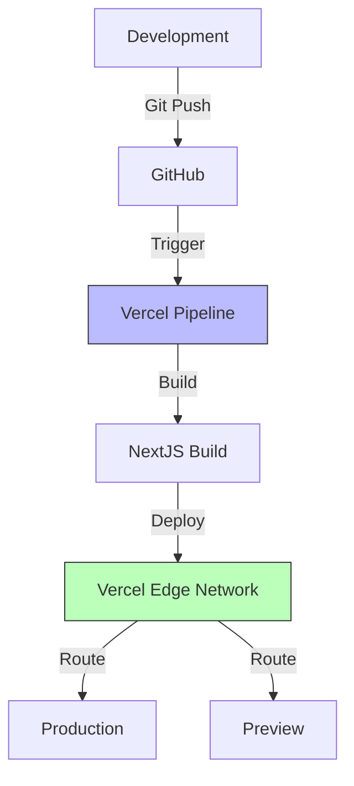
```mermaid
flowchart TD
    A[Development] -->|Git Push| B[GitHub]
    B -->|Trigger| C[Vercel Pipeline]
    C -->|Build| D[NextJS Build]
    D -->|Deploy| E[Vercel Edge Network]
    E -->|Route| F[Production]
    E -->|Route| G[Preview]
    
    style C fill:#bbf,stroke:#333
    style E fill:#bfb,stroke:#333
```

### Development Tools

| Tool | Purpose | Version |
|------|---------|---------|
| VS Code | IDE | Latest |
| pnpm | Package Management | 8.0+ |
| ESLint | Code Linting | 8.0+ |
| Prettier | Code Formatting | 3.0+ |
| TypeScript | Type Checking | 5.2+ |

### Deployment Pipeline

| Stage | Technology | Purpose |
|-------|------------|---------|
| Source Control | GitHub | Version control, collaboration |
| CI/CD | Vercel | Automated deployment, preview environments |
| Build System | NextJS | Asset optimization, bundling |
| Edge Network | Vercel Edge | Global content delivery |

### Environment Configuration

| Environment | Purpose | Deployment |
|-------------|---------|------------|
| Development | Local development | Local machine |
| Preview | PR testing | Vercel Preview |
| Staging | Pre-production testing | Vercel Preview |
| Production | Live environment | Vercel Production |

# 5. SYSTEM DESIGN

## 5.1 USER INTERFACE DESIGN

### 5.1.1 Layout Structure

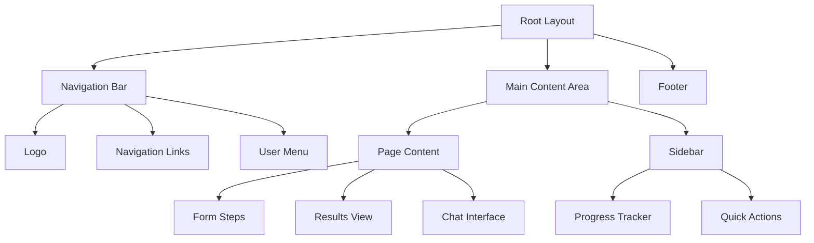
```mermaid
flowchart TD
    A[Root Layout] --> B[Navigation Bar]
    A --> C[Main Content Area]
    A --> D[Footer]
    
    B --> E[Logo]
    B --> F[Navigation Links]
    B --> G[User Menu]
    
    C --> H[Page Content]
    C --> I[Sidebar]
    
    H --> J[Form Steps]
    H --> K[Results View]
    H --> L[Chat Interface]
    
    I --> M[Progress Tracker]
    I --> N[Quick Actions]
```

### 5.1.2 Core Components

| Component | Description | Interactions |
|-----------|-------------|--------------|
| Navigation Bar | Fixed top bar with logo, nav links, user menu | - User dropdown<br>- Theme toggle<br>- Notifications |
| Form Wizard | Multi-step input collection | - Step validation<br>- Progress tracking<br>- Data persistence |
| Results Dashboard | Visualization of optimization results | - Interactive charts<br>- Expandable sections<br>- Export options |
| Chat Interface | AI-powered explanation interface | - Message threading<br>- Context retention<br>- Code/math formatting |

### 5.1.3 Responsive Breakpoints

| Breakpoint | Screen Width | Layout Adjustments |
|------------|--------------|-------------------|
| Mobile | < 640px | Single column, stacked navigation |
| Tablet | 640px - 1024px | Two column, condensed sidebar |
| Desktop | > 1024px | Three column, expanded sidebar |
| Wide | > 1280px | Maximum width container |

## 5.2 DATABASE DESIGN

### 5.2.1 Schema Overview

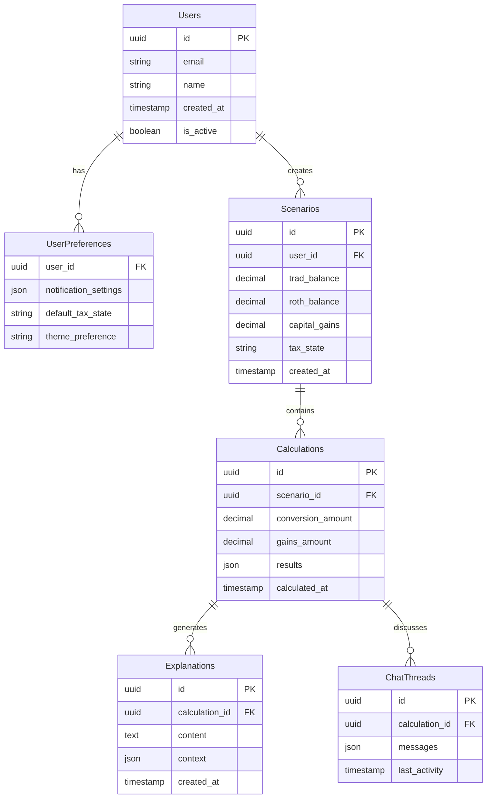
```mermaid
erDiagram
    Users ||--o{ UserPreferences : has
    Users ||--o{ Scenarios : creates
    Scenarios ||--o{ Calculations : contains
    Calculations ||--o{ Explanations : generates
    Calculations ||--o{ ChatThreads : discusses
    
    Users {
        uuid id PK
        string email
        string name
        timestamp created_at
        boolean is_active
    }
    
    UserPreferences {
        uuid user_id FK
        json notification_settings
        string default_tax_state
        string theme_preference
    }
    
    Scenarios {
        uuid id PK
        uuid user_id FK
        decimal trad_balance
        decimal roth_balance
        decimal capital_gains
        string tax_state
        timestamp created_at
    }
    
    Calculations {
        uuid id PK
        uuid scenario_id FK
        decimal conversion_amount
        decimal gains_amount
        json results
        timestamp calculated_at
    }
    
    Explanations {
        uuid id PK
        uuid calculation_id FK
        text content
        json context
        timestamp created_at
    }
    
    ChatThreads {
        uuid id PK
        uuid calculation_id FK
        json messages
        timestamp last_activity
    }
```

### 5.2.2 Indexing Strategy

| Table | Index | Type | Purpose |
|-------|--------|------|---------|
| Users | email | Unique | Login lookups |
| Scenarios | user_id, created_at | Composite | User history queries |
| Calculations | scenario_id | Foreign Key | Relationship integrity |
| ChatThreads | calculation_id, last_activity | Composite | Active chat retrieval |

## 5.3 API DESIGN

### 5.3.1 RESTful Endpoints

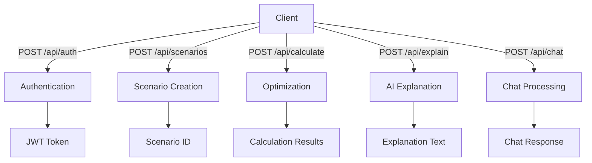
```mermaid
flowchart TD
    A[Client] -->|POST /api/auth| B[Authentication]
    A -->|POST /api/scenarios| C[Scenario Creation]
    A -->|POST /api/calculate| D[Optimization]
    A -->|POST /api/explain| E[AI Explanation]
    A -->|POST /api/chat| F[Chat Processing]
    
    B --> G[JWT Token]
    C --> H[Scenario ID]
    D --> I[Calculation Results]
    E --> J[Explanation Text]
    F --> K[Chat Response]
```

### 5.3.2 API Routes

| Endpoint | Method | Request Body | Response |
|----------|---------|--------------|-----------|
| /api/scenarios | POST | `{ tradBalance: number, rothBalance: number, capitalGains: number }` | `{ id: string, status: string }` |
| /api/calculate | POST | `{ scenarioId: string }` | `{ results: object, explanation: string }` |
| /api/chat | POST | `{ calculationId: string, message: string }` | `{ response: string, context: object }` |
| /api/export | GET | `{ scenarioId: string }` | `{ url: string }` |

### 5.3.3 WebSocket Events

| Event | Direction | Payload | Purpose |
|-------|-----------|---------|----------|
| calculation.progress | Server → Client | `{ progress: number }` | Real-time calculation updates |
| chat.typing | Server → Client | `{ status: boolean }` | Chat typing indicators |
| scenario.update | Server → Client | `{ scenario: object }` | Real-time scenario updates |

### 5.3.4 Error Handling

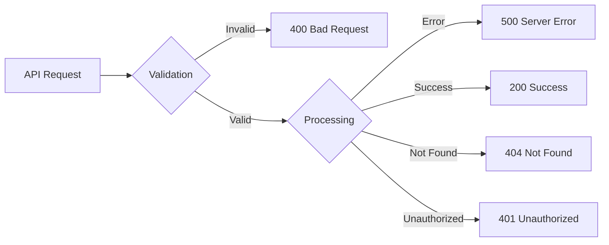
```mermaid
flowchart LR
    A[API Request] --> B{Validation}
    B -->|Invalid| C[400 Bad Request]
    B -->|Valid| D{Processing}
    D -->|Error| E[500 Server Error]
    D -->|Success| F[200 Success]
    D -->|Not Found| G[404 Not Found]
    D -->|Unauthorized| H[401 Unauthorized]
```

| Status Code | Description | Example Response |
|-------------|-------------|------------------|
| 400 | Invalid input | `{ error: "Invalid scenario data" }` |
| 401 | Authentication required | `{ error: "Please login" }` |
| 403 | Permission denied | `{ error: "Insufficient privileges" }` |
| 404 | Resource not found | `{ error: "Scenario not found" }` |
| 500 | Server error | `{ error: "Calculation failed" }` |

# 6. USER INTERFACE DESIGN

## 6.1 WIREFRAME KEY

```
ICONS                    INPUTS                  CONTAINERS
[?] Help/Info           [...] Text Input        +--+ Border
[$] Financial           [ ] Checkbox            |  | Container
[i] Information         ( ) Radio Button        --- Separator
[+] Add/Create          [v] Dropdown            
[x] Close/Delete        [Button] Button         PROGRESS
[<] [>] Navigation      [====] Progress Bar     [====] Complete
[^] Upload                                      [==  ] Partial
[#] Dashboard
[@] Profile
[!] Warning
[=] Settings
[*] Important
```

## 6.2 LANDING PAGE

```
+--------------------------------------------------------+
|  [#] Tax Optimizer    [@] Login    [=] Theme    [?]     |
+--------------------------------------------------------+
|                                                         |
|    +------------------------------------------+        |
|    |        Optimize Your Low Income Year      |        |
|    |                                          |        |
|    |  [Button: Get Started]  [Button: Learn More]      |
|    +------------------------------------------+        |
|                                                         |
|    +----------------+  +----------------+  +----------+ |
|    | [$] Roth Conv. |  | [$] Cap Gains |  | [i] AI   | |
|    | Optimize your  |  | Strategic tax  |  | Powered  | |
|    | conversions    |  | harvesting     |  | analysis | |
|    +----------------+  +----------------+  +----------+ |
|                                                         |
+--------------------------------------------------------+
```

## 6.3 SCENARIO INPUT WIZARD

```
+--------------------------------------------------------+
|  [<] Back    Current Step: Financial Information (1/3)   |
+--------------------------------------------------------+
|  [====================================  ] 66% Complete  |
|                                                         |
|  Traditional IRA Balance [$]                            |
|  [...........................] Min: $0  Max: $5,000,000 |
|                                                         |
|  Roth IRA Balance [$]                                   |
|  [...........................] Min: $0  Max: $5,000,000 |
|                                                         |
|  Long Term Capital Gains [$]                            |
|  [...........................] Min: $0  Max: $5,000,000 |
|                                                         |
|  Tax State [v]                                          |
|  [...Select State...........]                          |
|                                                         |
|  Filing Status                                          |
|  ( ) Single                                            |
|  ( ) Married Filing Jointly                            |
|  ( ) Head of Household                                 |
|                                                         |
|  [Button: Save Draft]        [Button: Next Step >]      |
+--------------------------------------------------------+
```

## 6.4 RESULTS DASHBOARD

```
+--------------------------------------------------------+
|  Optimization Results                     [^] Export PDF |
+--------------------------------------------------------+
|  +------------------+  +----------------------+         |
|  | Recommendations  |  | Tax Impact Analysis  |         |
|  |                  |  |                      |         |
|  | [*] Convert:     |  | Current Tax: $2,500  |         |
|  | $25,000 to Roth  |  | After Tax: $3,200    |         |
|  |                  |  | Savings:   $700      |         |
|  | [*] Realize:     |  +----------------------+         |
|  | $10,000 gains    |                                  |
|  +------------------+                                   |
|                                                         |
|  +--------------------------------------------------+ |
|  | [i] AI Assistant Chat                             | |
|  |                                                   | |
|  | Why should I convert $25,000?                     | |
|  | [...................................................] |
|  | [Button: Ask]                                     | |
|  +--------------------------------------------------+ |
|                                                         |
|  [Button: Save Scenario]  [Button: New Scenario]       |
+--------------------------------------------------------+
```

## 6.5 SAVED SCENARIOS

```
+--------------------------------------------------------+
|  My Scenarios        [+] New Scenario    [v] Filter     |
+--------------------------------------------------------+
|  +--------------------------------------------------+ |
|  | March 2024 Analysis                   [*] Current  | |
|  | Traditional: $100,000                             | |
|  | Recommendation: $25,000 Conversion               | |
|  | [Button: View] [Button: Compare] [x] Delete       | |
|  +--------------------------------------------------+ |
|                                                        |
|  +--------------------------------------------------+ |
|  | January 2024 Analysis                              | |
|  | Traditional: $95,000                               | |
|  | Recommendation: $20,000 Conversion                | |
|  | [Button: View] [Button: Compare] [x] Delete       | |
|  +--------------------------------------------------+ |
|                                                        |
|  [< Previous]  Page 1 of 3  [Next >]                  |
+--------------------------------------------------------+
```

## 6.6 RESPONSIVE DESIGN BREAKPOINTS

| Breakpoint | Width | Layout Changes |
|------------|-------|----------------|
| Mobile | < 640px | - Single column layout<br>- Stacked navigation<br>- Condensed charts |
| Tablet | 640px - 1024px | - Two column layout<br>- Side navigation<br>- Full charts |
| Desktop | > 1024px | - Three column layout<br>- Top navigation<br>- Extended charts |

## 6.7 COMPONENT SPECIFICATIONS

| Component | Framework | Styling |
|-----------|-----------|---------|
| Navigation | Shadcn Navbar | TailwindCSS dark/light themes |
| Forms | react-hook-form | Shadcn form components |
| Charts | Recharts | Custom TailwindCSS classes |
| Modals | Shadcn Dialog | System-native animations |
| Tables | Shadcn Table | Responsive grid fallback |
| Buttons | Shadcn Button | Custom state styles |

## 6.8 ACCESSIBILITY FEATURES

| Feature | Implementation |
|---------|---------------|
| Keyboard Navigation | Full tab index support |
| Screen Readers | ARIA labels and roles |
| Color Contrast | WCAG 2.1 AA compliant |
| Focus Indicators | Visible focus states |
| Error States | Color + icon indicators |
| Font Scaling | Responsive rem units |

# 7. SECURITY CONSIDERATIONS

## 7.1 AUTHENTICATION AND AUTHORIZATION

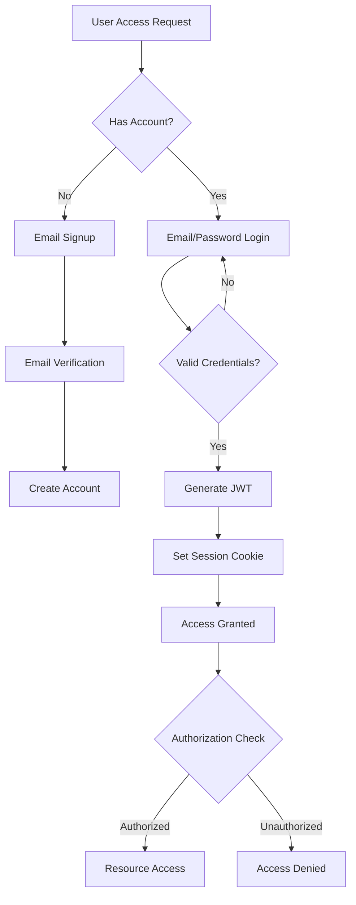
```mermaid
flowchart TD
    A[User Access Request] --> B{Has Account?}
    B -->|No| C[Email Signup]
    B -->|Yes| D[Email/Password Login]
    C --> E[Email Verification]
    E --> F[Create Account]
    D --> G{Valid Credentials?}
    G -->|No| D
    G -->|Yes| H[Generate JWT]
    H --> I[Set Session Cookie]
    I --> J[Access Granted]
    
    J --> K{Authorization Check}
    K -->|Authorized| L[Resource Access]
    K -->|Unauthorized| M[Access Denied]
```

| Security Layer | Implementation | Details |
|----------------|----------------|----------|
| Authentication | Supabase Auth | - Email/password authentication<br>- JWT token generation<br>- Session management |
| Session Management | HTTP-only Cookies | - 30-minute session timeout<br>- Secure cookie flags<br>- CSRF protection |
| Authorization | Role-Based Access | - User role permissions<br>- Resource-level access control<br>- API endpoint protection |
| Password Security | Bcrypt | - 12 rounds of hashing<br>- Password strength requirements<br>- Breach detection |

## 7.2 DATA SECURITY

### 7.2.1 Data Protection Measures

| Data Type | Protection Method | Implementation |
|-----------|------------------|----------------|
| Financial Data | AES-256 Encryption | Column-level encryption in Supabase |
| Personal Information | Hashing & Encryption | PII encryption with key rotation |
| Authentication Tokens | JWT with RSA | RS256 signature algorithm |
| API Keys | Vault Storage | Encrypted environmental variables |
| Backup Data | Encrypted Storage | AES-256 encrypted backups |

### 7.2.2 Data Access Controls

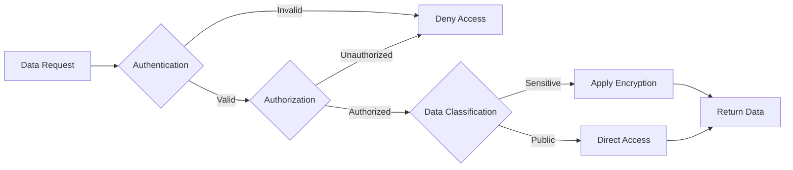
```mermaid
flowchart LR
    A[Data Request] --> B{Authentication}
    B -->|Invalid| C[Deny Access]
    B -->|Valid| D{Authorization}
    D -->|Unauthorized| C
    D -->|Authorized| E{Data Classification}
    E -->|Sensitive| F[Apply Encryption]
    E -->|Public| G[Direct Access]
    F --> H[Return Data]
    G --> H
```

## 7.3 SECURITY PROTOCOLS

### 7.3.1 Network Security

| Protocol | Implementation | Purpose |
|----------|----------------|---------|
| TLS 1.3 | Vercel Edge Network | Secure data transmission |
| HTTPS | Forced SSL | Encrypted client-server communication |
| WebSocket Security | Supabase Real-time | Secure real-time connections |
| API Security | Rate Limiting | 100 requests per minute per IP |
| DDoS Protection | Vercel Edge | Traffic filtering and analysis |

### 7.3.2 Security Monitoring

```mermaid
flowchart TD
    A[Security Events] --> B{Event Type}
    B -->|Authentication| C[Auth Monitoring]
    B -->|Data Access| D[Access Logs]
    B -->|API Usage| E[Rate Monitoring]
    B -->|System| F[Performance Monitoring]
    
    C --> G[Alert System]
    D --> G
    E --> G
    F --> G
    
    G -->|Critical| H[Immediate Alert]
    G -->|Warning| I[Daily Report]
```

### 7.3.3 Security Compliance

| Requirement | Implementation | Verification |
|-------------|----------------|--------------|
| GDPR | Data encryption, user consent | Annual audit |
| CCPA | Data access controls, deletion capability | Quarterly review |
| SOC 2 | Security monitoring, incident response | External audit |
| PCI DSS | Financial data handling | Automated scans |
| OWASP Top 10 | Security best practices | Penetration testing |

### 7.3.4 Incident Response

| Phase | Actions | Responsibility |
|-------|---------|---------------|
| Detection | - Log analysis<br>- Anomaly detection<br>- User reports | Security monitoring system |
| Containment | - Isolate affected systems<br>- Block suspicious IPs<br>- Disable compromised accounts | Security team |
| Eradication | - Remove malicious code<br>- Patch vulnerabilities<br>- Update security rules | Development team |
| Recovery | - Restore from backups<br>- Verify system integrity<br>- Resume operations | Operations team |
| Review | - Incident analysis<br>- Security update<br>- Documentation update | Security & management team |

### 7.3.5 Security Updates

| Component | Update Frequency | Process |
|-----------|-----------------|---------|
| Dependencies | Weekly | Automated vulnerability scanning |
| System Patches | Monthly | Scheduled maintenance window |
| Security Rules | As needed | Emergency deployment capability |
| SSL Certificates | 90 days | Automated renewal through Vercel |
| Access Reviews | Quarterly | Manual user access audit |

# 8. INFRASTRUCTURE

## 8.1 DEPLOYMENT ENVIRONMENT

The Low Income Year Tax Optimizer Tool utilizes a cloud-native deployment strategy through Vercel's edge network for optimal performance and scalability.

```mermaid
flowchart TD
    A[Production Environment] -->|Edge Network| B[Vercel Platform]
    B -->|Region 1| C[North America]
    B -->|Region 2| D[Europe]
    B -->|Region 3| E[Asia Pacific]
    
    C -->|Services| F[NextJS App]
    C -->|Services| G[Edge Functions]
    C -->|Services| H[Edge Cache]
    
    style B fill:#bbf,stroke:#333
    style F fill:#bfb,stroke:#333
```

| Environment | Purpose | Configuration |
|-------------|---------|---------------|
| Development | Local development | Local NextJS server, Supabase local instance |
| Preview | PR testing | Vercel preview deployments, Supabase development instance |
| Staging | Pre-production testing | Vercel staging branch, Supabase staging instance |
| Production | Live environment | Vercel production branch, Supabase production instance |

## 8.2 CLOUD SERVICES

| Service | Provider | Purpose | Justification |
|---------|----------|---------|---------------|
| Edge Hosting | Vercel | Application hosting and CDN | Native NextJS support, global edge network |
| Database | Supabase | Data persistence and real-time | PostgreSQL support, built-in auth |
| KV Storage | Vercel KV | Edge caching | Low-latency, distributed caching |
| Blob Storage | Vercel Blob | File storage | Edge-optimized, simple integration |
| AI Processing | OpenAI | GPT-4 processing | Leading AI capabilities |
| Email | Resend | Transactional email | Developer-friendly, high deliverability |

## 8.3 CONTAINERIZATION

The application utilizes Vercel's built-in containerization, eliminating the need for explicit Docker configuration.

```mermaid
flowchart LR
    A[Source Code] -->|Build| B[Vercel Build System]
    B -->|Package| C[Lambda Functions]
    B -->|Package| D[Edge Functions]
    B -->|Package| E[Static Assets]
    
    C -->|Deploy| F[Vercel Runtime]
    D -->|Deploy| F
    E -->|Deploy| G[Edge Network]
```

| Component | Packaging | Distribution |
|-----------|-----------|--------------|
| NextJS App | Vercel Build Output | Edge-optimized bundle |
| API Routes | Edge Functions | Distributed globally |
| Static Assets | CDN Assets | Edge-cached globally |

## 8.4 ORCHESTRATION

Vercel's platform handles orchestration automatically, managing:

- Load balancing
- Auto-scaling
- Health checks
- Zero-downtime deployments

```mermaid
flowchart TD
    A[User Request] -->|DNS| B[Vercel Load Balancer]
    B -->|Route| C[Edge Network]
    C -->|Process| D[Serverless Function]
    C -->|Cache| E[Edge Cache]
    C -->|Serve| F[Static Asset]
    
    D -->|Query| G[Supabase]
    D -->|Process| H[OpenAI]
```

## 8.5 CI/CD PIPELINE

```mermaid
flowchart LR
    A[GitHub Repository] -->|Push| B[GitHub Actions]
    B -->|Test| C[Unit Tests]
    B -->|Test| D[Integration Tests]
    B -->|Lint| E[Code Quality]
    
    B -->|Deploy| F[Vercel Pipeline]
    F -->|Build| G[Production Build]
    F -->|Deploy| H[Preview Deploy]
    F -->|Deploy| I[Production Deploy]
    
    style F fill:#bbf,stroke:#333
    style I fill:#bfb,stroke:#333
```

| Stage | Tools | Actions |
|-------|-------|---------|
| Source Control | GitHub | Code hosting, PR management |
| Testing | Jest, Cypress | Unit tests, E2E tests |
| Code Quality | ESLint, Prettier | Linting, formatting |
| Security | CodeQL | Security scanning |
| Build | Vercel Build | Asset optimization, bundling |
| Deployment | Vercel Deploy | Edge distribution, rollback capability |

### Deployment Process

1. **Development**
   - Local development with hot reloading
   - Supabase local development

2. **Pull Request**
   - Automated tests
   - Preview deployment
   - Performance checks

3. **Staging**
   - Integration testing
   - Load testing
   - Security scanning

4. **Production**
   - Zero-downtime deployment
   - Automated rollback capability
   - Health monitoring

| Environment | Branch Pattern | Deployment Trigger | Validation |
|-------------|----------------|-------------------|------------|
| Preview | feature/* | PR creation | Automated tests |
| Staging | develop | PR merge | Manual approval |
| Production | main | Release tag | Manual approval |

# APPENDICES

## A.1 ADDITIONAL TECHNICAL INFORMATION

### A.1.1 Tax Calculation Formulas

```mermaid
flowchart TD
    A[Input Tax Data] --> B{Filing Status}
    B -->|Single| C[Single Brackets]
    B -->|Joint| D[Joint Brackets]
    B -->|HoH| E[Head of Household]
    
    C --> F[Calculate Marginal Rate]
    D --> F
    E --> F
    
    F --> G[State Tax Impact]
    G --> H[Federal Tax Impact]
    H --> I[Combined Tax Effect]
    
    I --> J[NPV Calculation]
    J --> K[Optimization Result]
```

### A.1.2 Optimization Algorithm Parameters

| Parameter | Range | Default | Description |
|-----------|--------|---------|-------------|
| Time Horizon | 1-40 years | 20 years | Period for NPV calculations |
| Discount Rate | 1-10% | 7% | Rate for future value calculations |
| Risk Tolerance | 1-5 | 3 | Impact on recommendation aggressiveness |
| State Tax Weight | 0-100% | 100% | Consideration of state tax impact |

## A.2 GLOSSARY

| Term | Definition |
|------|------------|
| Marginal Tax Rate | The tax rate applied to the last dollar of income |
| Tax Bracket | A range of income subject to a specific tax rate |
| Cost Basis | The original value of an asset for tax purposes |
| Net Present Value | The current value of future cash flows |
| Tax Harvesting | Strategic realization of gains or losses for tax purposes |
| Required Minimum Distribution | Mandatory withdrawals from retirement accounts |
| Tax-Loss Harvesting | Selling securities at a loss to offset capital gains |
| Modified Adjusted Gross Income | Income calculation affecting various tax benefits |
| Step-Up Basis | Adjustment of asset value upon inheritance |
| Tax-Equivalent Yield | Pre-tax yield needed to equal a tax-free yield |

## A.3 ACRONYMS

| Acronym | Full Form |
|---------|-----------|
| AGI | Adjusted Gross Income |
| MAGI | Modified Adjusted Gross Income |
| RMD | Required Minimum Distribution |
| LTCG | Long Term Capital Gains |
| STCG | Short Term Capital Gains |
| QCD | Qualified Charitable Distribution |
| NIIT | Net Investment Income Tax |
| MFJ | Married Filing Jointly |
| HoH | Head of Household |
| MFS | Married Filing Separately |
| NPV | Net Present Value |
| IRR | Internal Rate of Return |
| API | Application Programming Interface |
| REST | Representational State Transfer |
| JWT | JSON Web Token |
| CRUD | Create, Read, Update, Delete |
| ORM | Object-Relational Mapping |
| SSO | Single Sign-On |
| MFA | Multi-Factor Authentication |
| CDN | Content Delivery Network |
| DNS | Domain Name System |
| SSL | Secure Sockets Layer |
| TLS | Transport Layer Security |
| HTTPS | Hypertext Transfer Protocol Secure |
| WCAG | Web Content Accessibility Guidelines |
| SEO | Search Engine Optimization |
| UI/UX | User Interface/User Experience |
| SDK | Software Development Kit |
| SPA | Single Page Application |
| SSR | Server-Side Rendering |
| CSR | Client-Side Rendering |
| HTML | Hypertext Markup Language |
| CSS | Cascading Style Sheets |
| JSON | JavaScript Object Notation |
| SQL | Structured Query Language |
| PII | Personally Identifiable Information |
| GDPR | General Data Protection Regulation |
| CCPA | California Consumer Privacy Act |